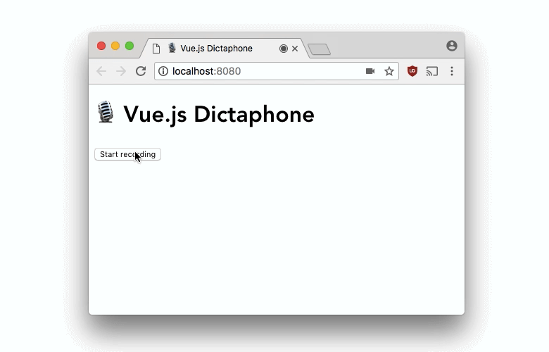

# vue-dictaphone

[](https://www.paypal.me/manuninja)

🎙️ Vue.js dictaphone component to record audio from the user



---

## Features

* HTML/CSS is fully customizable via [Scoped Slots](https://vuejs.org/v2/guide/components-slots.html#Scoped-Slots)
* Spectrum analyser for visualising frequencies (Optional)
* `stop` event returns an `$event` object containing
  * the audio blob (`$event.blob`) for further processing 
  * and a data URL (`$event.src`) for immediate output to the user
* Components emit an `error` event, when the browser does not support audio recording or the user has blocked microphone access.

## Installation

```
npm install --save vue-dictaphone
```

```
yarn add vue-dictaphone
```

## Usage

```js
import VueDictaphone from "vue-dictaphone";
Vue.use(VueDictaphone);
```

```html
<vue-dictaphone @stop="handleRecording($event)" 
                v-slot="{ isRecording, startRecording, stopRecording, deleteRecording }">
    <button v-if="!isRecording" @click="startRecording">Start recording</button>
    <button v-else @click="stopRecording">Stop recording</button>
</vue-dictaphone>

<vue-dictaphone-spectrum-analyser/>

<template v-if="audioSource">
  <audio :src="audioSource" controls></audio>
</template>
```

```js
new Vue({
  // ... 
  data: {
    audioSource: null
  },
  methods: {
    handleRecording({ blob, src }) {
      this.audioSource = src;
    }
  }
  // ... 
});
```

### File types

You can pass an optional `mime-type` prop on the `vue-dictaphone` element to change the MIME type of the recorded audio. 

```html
<vue-dictaphone @stop="handleRecording($event)" mime-type="audio/mp3">
  <!-- ... -->
</vue-dictaphone>
```

For a list of MIME types supported by major browsers take a look a [Media formats for HTML audio and video](https://developer.mozilla.org/en-US/docs/Web/HTML/Supported_media_formats#File_formats) on MDN.

## Author

Manuel Wieser<br>
<https://manu.ninja/><br>
<https://twitter.com/manuelwieser><br>
<https://www.paypal.me/manuninja><br>
